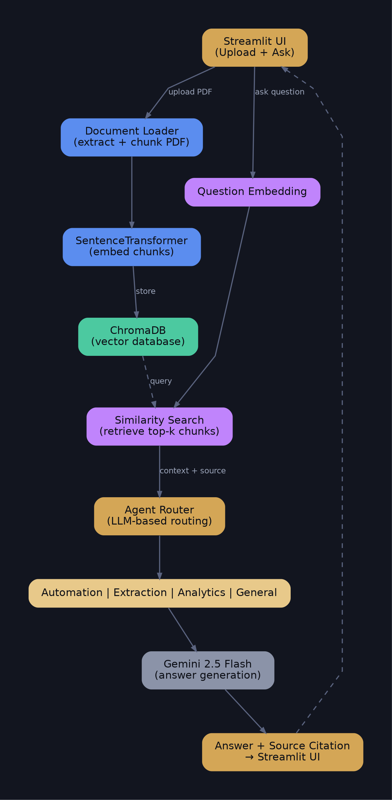

# AI Agentic RAG System

An intelligent document Q&A system that lets you upload PDF documents and ask
natural-language questions about their content. The system retrieves the most
relevant information from your documents and generates accurate, context-aware
answers using Google's Gemini large language model — routed through specialized
AI agents depending on the type of question asked.

🔗 **Live App:** [Add your Streamlit Cloud link here once deployed]

---

## Overview

Traditional chatbots answer from general knowledge and often hallucinate facts.
This project solves that problem using **Retrieval-Augmented Generation (RAG)**:
instead of asking the LLM to answer from memory, the system first searches your
uploaded documents for the most relevant passages, then feeds only that context
to Gemini. This produces answers that are grounded in your actual documents,
with source citations for verification.

On top of the RAG pipeline, the system includes an **agentic layer** — three
specialized AI agents (Automation, Extraction, Analytics) that handle different
categories of questions differently, plus a routing layer that decides which
agent should respond, either using Gemini itself (LLM-based routing) or keyword
matching.

---

## Key Features

| Feature | Description |
|---|---|
| **PDF Ingestion** | Upload one or more PDF files directly through the web UI |
| **RAG Pipeline** | Text is chunked, embedded, stored in a vector database, and retrieved by semantic similarity |
| **Gemini LLM Integration** | All final answers are generated by Google's `gemini-2.5-flash` model |
| **Multi-Agent System** | Automation, Extraction, and Analytics agents handle different question types |
| **LLM-Based Routing** | Gemini itself decides which agent best fits a question (more accurate than keyword rules) |
| **Multiple Answer Modes** | Single agent, matching agents, or compare all agents side-by-side |
| **Source Citations** | Every answer shows which uploaded PDF it was derived from |
| **Persistent Vector Storage** | Documents remain searchable across sessions via ChromaDB |

---

## Architecture

---

## Tech Stack

- **LLM**: Google Gemini 2.5 Flash
- **Embeddings**: SentenceTransformers (`all-MiniLM-L6-v2`)
- **Vector Database**: ChromaDB
- **PDF Parsing**: pypdf
- **Frontend**: Streamlit
- **Language**: Python 3.12

---

## Example Questions to Try

| Question | Agent Triggered |
|---|---|
| "How many annual leaves do employees get?" | Extraction |
| "Summarize the leave policy trends" | Analytics |
| "Generate a workflow for requesting remote work" | Automation |
| "What is the office dress code?" | General (plain RAG) |

---

## One-Line Summary

> This project implements Retrieval-Augmented Generation (RAG): user questions
> are first matched against a vector database of document embeddings to
> retrieve relevant context, which is then passed to Gemini to generate an
> accurate, source-grounded answer — reducing hallucination compared to a
> plain LLM chatbot. A multi-agent routing layer further specializes how
> different types of questions (automation, extraction, analytics) are handled.
