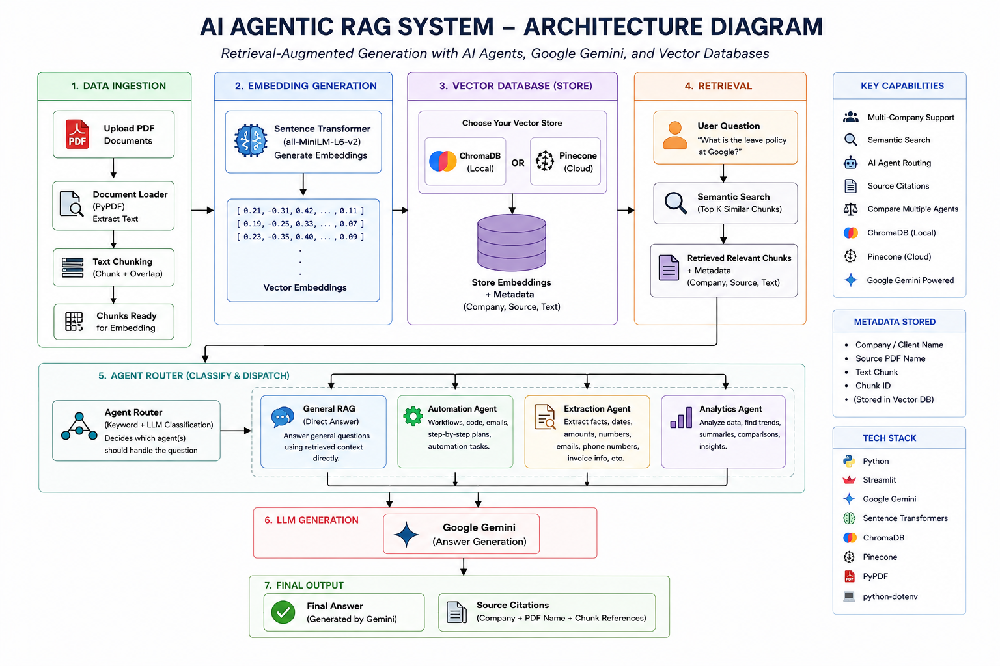

# 🤖 AI Agentic RAG System

An intelligent **Multi-Agent Retrieval-Augmented Generation (RAG)** system built with **Python, Streamlit, Google Gemini, ChromaDB, and Pinecone**.

Upload PDF documents, manage them by company, and ask natural-language questions — get accurate, source-grounded answers generated by Gemini and routed through specialized AI agents, all in a ChatGPT-style chat interface.

---

## 🚀 Live Demo

🔗 **Try the App:** https://ai-agentic-rag-system-caivs8j9bpu6jj3g7wbxfl.streamlit.app/

---

## 📌 Overview

Traditional chatbots answer from general knowledge and often hallucinate facts. This project uses **Retrieval-Augmented Generation (RAG)**: the system first searches your uploaded documents for the most relevant passages, then feeds only that context to Gemini — producing answers that are grounded in your actual documents, with citations for verification.

On top of the RAG pipeline, the system includes an **agentic layer** — three specialized AI agents that handle different categories of questions, plus a routing layer that decides which agent should respond.

---

## 📋 Features

### 🧠 RAG Core
- 📄 Upload and process multiple PDF documents
- ✂️ Automatic text chunking with overlap
- 🔎 Semantic search using Sentence Transformers (`all-MiniLM-L6-v2`)
- 🤖 Google Gemini 2.5 Flash integration for answer generation
- 🗄️ **ChromaDB** for local vector storage (default, zero setup)
- ☁️ **Pinecone** support for permanent cloud storage (auto-detected — used automatically if a Pinecone API key is configured, otherwise falls back to ChromaDB)

### 🏢 Multi-Company Document Management
- Each uploaded PDF is tagged with a company/client name at upload time
- Sidebar lists all uploaded documents **grouped by company**
- 🗑️ Delete an individual document (with confirmation popover)
- 🗑️ Delete all documents at once (with confirmation popover)
- 📊 Live stats card showing total documents, companies, and messages
- Ask questions across **all companies**, or restrict the search to **one specific company**
- Every answer shows exactly which company and which PDF each piece of information came from (citation chips)

### 🤖 AI Agents
| Agent | Responsibility |
|---|---|
| 🛠️ **Automation** | Workflows, code snippets, emails, step-by-step plans |
| 📑 **Extraction** | Specific facts — dates, amounts, numbers pulled from documents |
| 📈 **Analytics** | Trend analysis, comparisons, summaries |
| 🧠 **General** | Plain question-answering from retrieved context |

### 🎯 Answer Modes
- **Single (Fastest)** — Gemini itself decides which one agent best fits the question (LLM-based routing)
- **Matching** — every agent whose keywords match the question answers
- **Compare All** — all agents answer the same question side-by-side

### 💬 Interface
- ChatGPT-style chat bubbles — user messages on the right, AI responses on the left with an avatar
- Color-coded agent badges (Automation = blue, Extraction = green, Analytics = purple, General = gold)
- Fixed bottom input bar
- Collapsible "View Retrieved Context" panel for transparency
- Fade-in animations, dark GitHub-inspired theme

---

## 🏗️ System Architecture

<p align="center">
  
</p>

---

## 📂 Project Structure

```
AI-Agentic-RAG-System/
│
├── agents.py               # Automation, Extraction, Analytics agents + router
├── config.py                # API keys, model names, folder paths
├── document_loader.py       # PDF text extraction & chunking
├── gemini_client.py         # Google Gemini API wrapper
├── vector_store.py          # ChromaDB / Pinecone dual-backend vector store + document management
├── rag_engine.py             # Connects every component together
├── main.py                   # Streamlit UI (ChatGPT-style, document management)
├── requirements.txt          # Python dependencies
├── architecture-diagram.png
├── README.md
└── .gitignore
```

---

## 📖 How It Works

1. **Upload** — user uploads a PDF and tags it with a company name
2. **Chunking** — text is extracted and split into overlapping chunks
3. **Embedding** — each chunk is converted to a vector using SentenceTransformers
4. **Storage** — vectors are stored in ChromaDB or Pinecone, tagged with source PDF + company
5. **Management** — user can view all documents grouped by company, and delete individual files or all data
6. **Question** — user asks a question, optionally filtered to one company
7. **Retrieval** — the vector store returns the most relevant chunks + their source
8. **Routing** — Gemini (or keyword rules) decides which agent should answer
9. **Generation** — the selected agent sends context + question to Gemini
10. **Response** — the answer, agent badge, and citation chips are shown in a chat bubble

---

## ⚙️ Tech Stack

- **LLM**: Google Gemini 2.5 Flash
- **Embeddings**: SentenceTransformers (`all-MiniLM-L6-v2`)
- **Vector Database**: ChromaDB (local) / Pinecone (permanent cloud)
- **PDF Parsing**: pypdf
- **Frontend**: Streamlit
- **Language**: Python 3.12

---

## 🚀 Installation

```bash
git clone https://github.com/MahnoorHassan231/AI-Agentic-RAG-System.git
cd AI-Agentic-RAG-System
pip install -r requirements.txt
```

Create a `.env` file:
```env
GEMINI_API_KEY=YOUR_GEMINI_API_KEY
PINECONE_API_KEY=YOUR_PINECONE_API_KEY
PINECONE_INDEX_NAME=ai-rag-project
```

Run:
```bash
streamlit run main.py
```

---

## 💬 Example Questions to Try

| Question | Agent Triggered |
|---|---|
| "How many annual leaves do employees get?" | Extraction |
| "Summarize the leave policy trends" | Analytics |
| "Generate a workflow for requesting remote work" | Automation |
| "What is the office dress code?" | General |

---

## 🎯 Future Improvements

- OCR support for scanned PDFs
- Image understanding (multi-modal RAG)
- Conversation memory (follow-up questions)
- Hybrid search (keyword + semantic)
- Web document ingestion (URLs)
- User authentication
- Docker deployment

---

## 👩‍💻 Author

**Mahnoor Hassan**
AI Student | Python Developer | AI & Machine Learning Enthusiast

📌 GitHub: [MahnoorHassan231](https://github.com/MahnoorHassan231)

---

⭐ If you found this project useful, don't forget to star the repository!

---

## 📄 License

This project is licensed under the **MIT License**.